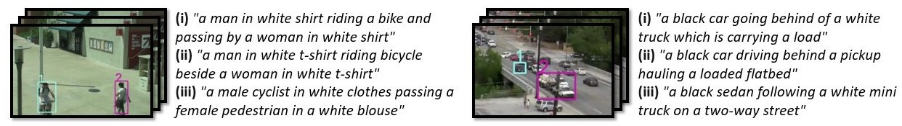

# Searching for Ambiguous Objects in Videos using Relational Referring Expressions: Dataset, Code and Pre-trained Models

This repository contains the dataset and code of our work entitled "[Searching for Ambiguous Objects in Videos using Relational Referring Expressions](arxiv)" which is accepted to be presented at [BMVC2019](https://bmvc2019.org/). Our work focuses on especially describing ambiguous objects in relation to other objects in the scene. For this end, we collect a challenging video referring expression dataset (called VIREF) and a feature-level attention-based recurrent deep architecture for both referring expression generation and comprehension for objects in videos.  

<p align="center">
  
</p>

<p align="center">
  
   
</p>

See [this video](https://youtu.be/vv1TcFnb7uc) for more examples.

# The METU-VIREF Dataset: A Dataset of Relational Referring Expressions for Describing Ambiguous Objects in Videos
For our dataset, we used the videos from [VIRAT Ground](http://www.viratdata.org/) and [ILSVRC2015 VID](http://image-net.org/challenges/LSVRC/2015/) datasets. VIRAT is a surveillance dataset and contains mainly people and vehicles. To line up with this and restrict our domain, we only used videos that contain vehicles from the ILSVRC dataset. Our dataset does not contain whole videos from these datasets (the videos need to be downloaded from the respective sources) but just referring expressions for video sequences containing an object pair. For this, we chose object pairs which had a relation that a meaningful referring expression could be written for. 

We crowdsourced the collection of referring expressions via the [Microworkers](https://www.microworkers.com/) platform. For each object pair video sequence, we requested 3 REs describing the first object using the second object and 3 doing the reverse order (the order is important). For further information please check our [paper](arxiv).  

The dataset can be downloaded using [this link](data/refexp.csv). In our annotation format, every row contains `video name`, `obj1_id`, `obj2_id`, `referring expression`. For videos chosen from the VIRAT Ground Dataset, ids are the object ids and for the ones from the ILSVRC2015 VID Dataset, ids are the track ids.  

## Information about the videos in our dataset:  

|                       |Average (Minimum, Maximum)|
|-----------------------|:------------------------:|
|Sequence length (sec)  | 19.00 (1, 42)            |
|# of objects per video | 9.38 (2, 46)             |
|# of pairs per video   | 19.57 (2, 148)           |
|# of videos            | 125 (VIRAT) + 37 (ILSVRC)|
|# of objects (total)   | 1520                     |
|# of pairs (total)     | 3170                     |


## Information about the referring expressions in our dataset:  

|                                 |Average (Minimum, Maximum)|
|---------------------------------|:------------------------:|
|RE length                        | 11.70 (5, 37)            |
|# of REs per object              | 12.51 (6, 90)            |
|# of REs                         | 9510                     |
|# of different words in REs      | 708 (occuring more than once) + 370 (occuring once)|


## Some visuals from the dataset:  



# Running the code
This guide assumes you have git installed and you are using a linux-based operating system.  

Clone this repository:  
```
git clone https://github.com/hazananayurt/viref.git
```
We are going to assume that the environment variable `$VIREF_ROOT` is the root directory of your copy of this repository.  

## Requirements
This project is tested in Python3.5. The versions we used while running the code are also given below.  

To install pytorch, [this guide](https://pytorch.org/get-started/locally/) can be followed. (pytorch\=\=1.1.0)  
To install tensorflow, [this guide](https://www.tensorflow.org/install/) can be followed. (tensorflow\=\=1.14.0) 

Other packages that we used are:  
```
keras==2.2.4
nltk==3.4.4
numpy==1.16.4
opencv-python==4.1.0.25
```

## Testing the models
Without training or extracting features, the models can be tested directly using the pre-trained models, pre-extracted feautures and GloVe word representations.  

- Download the pre-extracted features using [this link](https://drive.google.com/file/d/1NWwJO6HSQXF_x3S7S-EMaX960kRoZV0j/view?usp=sharing). 

- Then, go to the download location and execute:  
```bash
unzip extracted_features.zip
mv extracted_features/* $VIREF_ROOT/features/
rm -rf extracted_features/
```
- Download the pre-trained models using [this link](https://drive.google.com/file/d/1Q0zhDZ3sts48ucHyqClCRdtSwNSqOICu/view?usp=sharing). (These weights are not identical to the ones used in obtaining the results in the paper.)

- Then, go to the download location and execute:  
```bash
unzip pretrained_models.zip
mv pretrained_models/viref/model_save $VIREF_ROOT/viref/
mv pretrained_models/viref_wo_a/model_save $VIREF_ROOT/viref_wo_a/
mv pretrained_models/viref_wo_e/model_save $VIREF_ROOT/viref_wo_e/
rm -rf pretrained_models/
```
- Download the [GloVe word representations](https://nlp.stanford.edu/projects/glove/) by executing:  
```bash
cd $VIREF_ROOT/data/
wget http://nlp.stanford.edu/data/glove.6B.zip
unzip glove.6B.zip
rm glove.6B.100d.txt glove.6B.200d.txt glove.6B.300d.txt
```
- To do the tests, run the following:
```bash
cd $VIREF_ROOT/
python test.py
```
**The script above runs generation tests on "VIREF" model by default and does not enable cuda usage.** It can be specified which model to run the tests on, the test type and many other things through command line arguments. For example, to run comprehension tests on VIREF-e using cuda, the following script can be used:  
```bash
python test.py --model=viref-e --cuda --type=comprehension
```
To learn about other arguments, help can be used:  
```bash
python test.py -h
```

Some of the example outputs of the models can be seen below:  


## Training the models using pre-extracted features:
By downloading and moving the pre-extracted feautures and GloVe word representations as described above, the training procedure can be started:  
```bash
cd $VIREF_ROOT/
python train.py
```
**This script by default trains VIREF model without using cuda.** The model that is going to be trained, cuda usage, learning rate and many other things can be selected using command line arguments. For example, to train VIREF-a model with cuda, the following script can be used:  
```bash
python train.py --model=viref-a --cuda
```
To learn about other arguments, help can be used:  
```bash
python train.py -h
```

To generate other random train, validation, test splits than the one we used, this python script can be used:  
```bash
python split_train_test_val.py
```

## Extracting the features from scratch
To extract features from scratch, [VIRAT Ground Dataset Release2.0](http://www.viratdata.org/) and [ILSVRC2015 VID](http://image-net.org/challenges/LSVRC/2015/) datasets must be put into `$VIREF_ROOT/data/`. Since ILSVRC2015 VID dataset is a large one, it is recommended to have a symbolic link to it if you already have it downloaded. Another option can be copying only the necessary video sequences from the dataset. However, the directory structure of the original ILSVRC2015 VID must be preserved. The names of the video sequences that we used are:  
```
ILSVRC2015_train_00897012, ILSVRC2015_train_00980000, ILSVRC2015_train_00147000, ILSVRC2015_train_00715002, ILSVRC2015_train_00361000, ILSVRC2015_train_00755000, ILSVRC2015_train_00897004, ILSVRC2015_train_00358000, ILSVRC2015_train_00897007, ILSVRC2015_train_00272009, ILSVRC2015_train_00010040, ILSVRC2015_train_00053012, ILSVRC2015_train_00010037, ILSVRC2015_train_00047001, ILSVRC2015_train_00272000, ILSVRC2015_train_00025035, ILSVRC2015_train_00897006, ILSVRC2015_train_00184004, ILSVRC2015_train_00225001, ILSVRC2015_train_00302001, ILSVRC2015_train_00783000, ILSVRC2015_train_00492000, ILSVRC2015_train_00897003, ILSVRC2015_train_01113000, ILSVRC2015_train_00302015, ILSVRC2015_train_00698000, ILSVRC2015_train_00184005, ILSVRC2015_train_00302010, ILSVRC2015_train_00743001, ILSVRC2015_train_00240014, ILSVRC2015_train_00684001, ILSVRC2015_train_00073027, ILSVRC2015_train_00897008, ILSVRC2015_train_00073031, ILSVRC2015_train_00662000, ILSVRC2015_train_00755001, ILSVRC2015_train_00293000
```

2 pretrained models are employed as feature extractors. The first one is the pretrained VGG-16 model provided by Keras, and the other one is [c3d-keras](https://github.com/axon-research/c3d-keras) which is a Keras implementation of [C3D](https://github.com/facebook/C3D).   

- Download the keras implementation of C3D:  
```bash
cd $VIREF_ROOT/
bash download_c3d.sh
```

- Download the already converted Keras model using [this link](https://drive.google.com/file/d/1-vvdsrd5GKM8xQyxNrjs2Pvrv0rbABE2/view?usp=sharing). Then, go to the download location and execute:  
```bash
unzip converted_c3d_models.zip
mv converted_c3d_models/* $VIREF_ROOT/feature_extractors/c3d-keras/models/
rm -rf converted_c3d_models/
```


- Extract the features (this may take a long time):  
```bash
cd $VIREF_ROOT/
python extract_features.py
```


## (OPTIONAL) Convert the Caffe model of C3D to Keras
The C3D implementation we use is written in **Python2** and has different requirements. Therefore, the conversion code requirements are different and as follows:  
```
h5py==2.9.0
tensorflow==1.14.0	
keras==2.2.4
numpy==1.16.4
protobuf==3.9.0
```
Additionally, this package must be installed:  
```bash
sudo apt-get install protobuf-compiler
```

Using the requirements above, the conversion can be done by executing:  
```bash
cd $VIREF_ROOT/feature_extractors/c3d-keras/
# Use Python2 environment
python convert_caffe_model.py
```

# Citing Our Work
To cite our dataset or work, the following bibtex can be used:
```
@inproceedings{anayurt2019,
  title={Searching for Ambiguous Objects in Videos using Relational Referring Expressions},
  author={Hazan Anayurt and Sezai Artun Ozyegin and Ulfet Cetin and Utku Aktas and Sinan Kalkan},
  booktitle={Proceedings of the British Machine Vision Conference (BMVC)},
  year={2019},
}
```
# License
The VIREF Dataset is provided under [Creative Commons Attribution 4.0 International](https://creativecommons.org/licenses/by/4.0/).  

To see the license of the code, please refer to [LICENSE](LICENSE).

# Acknowledgments

This work was partially supported by the Scientific and Technological Research Council of Turkey (TUBITAK) through the project titled "Object Detection in Videos with Deep Neural Networks" (project no 117E054). The authors would like to thank Dr. Emre Akbas for discussions and suggestions on the paper.

# Authors

- Hazan Anayurt, email: [hazan.anayurt@metu.edu.tr](mailto:hazan.anayurt@metu.edu.tr)
- Sezai Artun Ozyegin, email: [artun.ozyegin@metu.edu.tr](mailto:artun.ozyegin@metu.edu.tr)
- Ulfet Cetin, email: [ulfet.rwth@gmail.com](mailto:ulfet.rwth@gmail.com)
- Utku Aktas, email: [utkuaktascs@gmail.com](mailto:utkuaktascs@gmail.com)
- Sinan Kalkan, email: [skalkan@metu.edu.tr](mailto:skalkan@metu.edu.tr)
